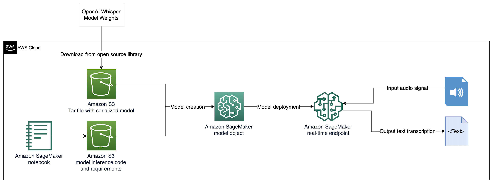

# Whisper Transcription with Amazon SageMaker

This repository show's how to use [SageMaker's real-time inference endpoints](https://docs.aws.amazon.com/sagemaker/latest/dg/realtime-endpoints.html) to host [OpenAI's Whisper](https://github.com/openai/whisper) model for audio-to-text transcription in real time. By using Amazon SageMaker's real-time model inference endpoints, this repository illustrates how to utilize the power and flexibility of SageMaker hosting in conjunction with open source generative models.

## Getting Started

In order to run the example in this repo, navigate to the [notebook](./whisper-inference-deploy.ipynb). This notebook can be run end-to-end in [Sagemaker Studio](https://aws.amazon.com/sagemaker/studio/). We recommend using the Data Science image, the Python 3 kernel, and a ml.m5.large instance inside of SageMaker Studio to run the notebook. Running through the notebook you will be able to...

1. Save a serialized Whisper model to Amazon S3
2. Create a SageMaker model object from this serialized model
3. Deploy a SageMaker real time endpoint with a custom script for audio-to-text transcription
4. Send in audio signals in real time for transcription
5. Delete the SageMaker endpoint

## How it Works

This repository deploys a SageMaker endpoint with a custom inference script similar to this [example in the SageMaker SDK documentation](https://sagemaker-examples.readthedocs.io/en/latest/introduction_to_amazon_algorithms/xgboost_abalone/xgboost_inferenece_script_mode.html). The components required to deploy a pre-trained model to an endpoint in SageMaker are 1) a serialized model artifact (tar file) in Amazon S3 and 2) the code and requirements which runs inference. These components are then packaged into a SageMaker endpoint which serves the serialized model with custom code behind as an API. See the architecture below for a visual description.

## Contributing

Please see the [CONTRIBUTING](./CONTRIBUTING.md) file for details on contributing.

## License

This library is licensed under the MIT License. See the [LICENSE](./LICENSE) file for specifics.

## Disclaimer

This guidance is for informational purposes only.  You should still perform your own independent assessment, and take measures to ensure that you comply with your own specific quality control practices and standards, and the local rules, laws, regulations, licenses and terms of use that apply to you, your content, and the third-party generative AI service referenced in this guidance.  AWS has no control or authority over the third-party generative AI service referenced in this guidance, and does not make any representations or warranties that the third-party generative AI service is secure, virus-free, operational, or compatible with your production environment and standards. AWS does not make any representations, warranties or guarantees that any information in this guidance will result in a particular outcome or result.  
